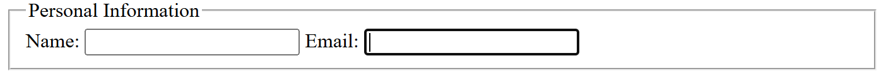

# HTMLQuestions
### **Beginner-Level HTML Questions and Answers**

---

### **1. What is HTML and what is its latest version?**
**HTML (HyperText Markup Language)** is the standard language for creating web pages. It provides structure to a webpage using elements and tags.
 It is **not a software** but a **markup language** that is interpreted by web browsers.  
Modern browsers (like Chrome, Firefox, Edge) **already support** it, so there is **no need to install** anything separately.  


- **HyperText**: Text linked to other documents.
- **Markup Language**: Uses tags to define elements.
Markup means - How to present data

 HTML5 is the latest version of **HTML (HyperText Markup Language)**. It introduces new features for **better multimedia support, storage management, and improved semantics**.

 HTML5 includes new features such as:  
✅ **Multimedia support** – `<audio>` and `<video>` tags.  
✅ **Storage mechanisms** – `localStorage` and `sessionStorage`.  
✅ **Improved forms** – New input types like `email`, `date`, and `color`.  
✅ **Canvas API** – Allows drawing graphics without plugins.  

Example:
```html
<!DOCTYPE html>
<html>
  <head>
    <title>My First Page</title>
  </head>
  <body>
    <h1>Hello, World!</h1>
  </body>
</html>
```

---

### **2. What are HTML tags?**
HTML tags are special keywords enclosed in **angle brackets (`<>`)** that define elements in an HTML document.

Example:
```html
<p>This is a paragraph.</p>
```
- `<p>` is an opening tag.
- `</p>` is a closing tag.
- Everything in between is the **content**.

---

### **3. What is the difference between HTML and XHTML?**
| Feature      | HTML (HyperText Markup Language) | XHTML (Extensible HTML) |
|-------------|--------------------------------|------------------------|
| Case Sensitivity | Not case-sensitive (`<P>` and `<p>` are same) | Case-sensitive (`<p>` only) |
| Closing Tags | Some tags can be left open | Every tag must be closed |
| Formatting | More flexible | More strict |
| Self-Closing Tags | `<br>`, `` allowed | `<br />`, `` required |

---

### **4. Explain the structure of an HTML document.**
```html
<!DOCTYPE html>  <!-- Declares HTML5 -->
<html> <!-- root -->
  <head>
    <title>My Page</title>  <!-- Page title (shown on the browser tab) -->
  </head>
  <body>
    <h1>Welcome</h1>  <!-- Main heading -->
    <p>This is a paragraph.</p>
  </body>
</html>
```
- `<!DOCTYPE html>`: Declares HTML5.
- `<html>`: Root element.
- `<head>`: Contains metadata. Metadata means data for data
- `<body>`: Contains visible content.

---

### **5. What is the difference between block-level and inline elements?**
| Feature          | Block-Level Elements | Inline Elements |
|-----------------|----------------------|----------------|
| Takes full width? | Yes | No |
| Starts on a new line? | Yes | No |
| Example | `<div>`, `<p>`, `<h1>`,`<body>` | `<span>`, `<a>`, `<strong>`,`` |

Example:
```html
<div>This is a block-level element.</div>
<span>This is an inline element.</span>
```

---

### **6. What is the purpose of the `<head>` tag?**
The `<head>` tag contains metadata and links to external resources.

Example:
```html
<head>
  <title>My Website</title>
  <meta charset="UTF-8">
  <meta name="viewport" content="width=device-width, initial-scale=1.0">
  <meta name="description" content="HTML tutorial">
  <link rel="stylesheet" href="styles.css">
</head>
```
### **📌 What is `name="viewport"`?**
The **viewport meta tag** tells the browser **how to control the page’s dimensions and scaling**, especially on **mobile devices**.
Without the viewport tag:
- **Mobile screens shrink the website** to fit the full page.
- **Text appears tiny**, requiring zooming and scrolling.
### **🔹 Breakdown:**
- ✅ `name="viewport"` → Targets the viewport settings.
- ✅ `content="width=device-width"` → Ensures the page width matches the screen width.
- ✅ `content="initial-scale=1.0"` → Sets the default zoom level (1.0 means **no zoom**).

---

### **7. Difference between `<head>`, `<body>`, and `<html>`?**
- `<html>`: Root element.
- `<head>`: Contains metadata, title, and links.
- `<body>`: Contains content visible to users.

Example:
```html
<html>
  <head>
    <title>My Page</title>
  </head>
  <body>
    <p>Hello, world!</p>
  </body>
</html>
```

---

### **8. What are self-closing tags in HTML?**
Self-closing tags **do not require a closing tag**.

Example:
```html

<br>
<input type="text" placeholder="Enter name">
<hr>
```

---

### **9. Difference between `<div>` and `<span>`?**
| Feature  | `<div>` | `<span>` |
|----------|--------|---------|
| Type | Block-level | Inline |
| Purpose | Grouping large sections | Styling a small section |
| Example | Layout structures | Highlighting text |

Example:
```html
<div><!-- Content Division Element -->
  <h1>Title</h1>
  <p>This is a paragraph.</p>
</div>

<p>This is a <span style="color: red;">red</span> word.</p>
```

---

### **10. What are semantic HTML elements?**
Tags are of two types :
- **Semantic elements** -  give meaning to content.
- **Non-Semantic elements** - do not provide any information about their content.


Examples for Semantic:
- `<header>`: Defines a page header.
- `<nav>`: Defines navigation links.
- `<article>`: Defines an article.
- `<footer>`: Defines the footer.
- `<main>`: Defines the main content of the document.
- `<section>`: Defines a section in a document. 

Example:
```html
<main>
  <header>
    <h1>Website Title</h1>
  </header>
  <nav>
    <a href="#">Home</a> | <a href="#">About</a>
  </nav>
  <section>
    <article>
      <h2>Article Title</h2>
      <p>Article content...</p>
    </article>
  </section>
  <footer>
    <p>Copyright 2025</p>
  </footer>
</main>
```

---

### **11. What is the `<meta>` tag used for?**
The `<meta>` tag defines metadata about the webpage.

Example:
```html
<meta charset="UTF-8">
<meta name="description" content="Free HTML tutorial">
<meta name="keywords" content="HTML, CSS, JavaScript">
<meta name="author" content="John Doe">
```

---

### **12. Explain the difference between absolute and relative URLs in HTML.**
| Type | Example | Description |
|------|---------|-------------|
| **Absolute URL** | `https://example.com/page.html` | Full URL including domain |
| **Relative URL** | `/page.html` | Path within the same website |

Example:
```html
<a href="https://example.com/about.html">Absolute Link</a>
<a href="/about.html">Relative Link</a>
```

---

### **13. What is the purpose of the `<title>` tag in HTML?**
The `<title>` tag defines the page title **visible in the browser tab**.

Example:
```html
<head>
  <title>My Web Page</title>
</head>
```

---

### **14. How do you insert an image in HTML? What attributes are required?**
The `` tag inserts images.

Example:
```html

```
- `src`: Image path.
- `alt`: Alternative text.

---

### **15. How do you create a hyperlink in HTML?**
Use the `<a>` tag.

Example:
```html
<a href="https://example.com">Visit Example</a>
```

---

### **16. What is the `alt` attribute in images?**
The `alt` attribute **provides alternative text** if an image fails to load.

Example:
```html

```

---

### **17. How do you create an ordered and unordered list in HTML?**
Ordered List:
```html
<ol>
  <li>First item</li>
  <li>Second item</li>
</ol>
```
Unordered List:
```html
<ul>
  <li>First item</li>
  <li>Second item</li>
</ul>
```

---

### **18. What are the different input types in HTML5?**
Some common input types:
```html
<input type="text"> <!-- By default -->
<input type="password">
<input type="email">
<input type="number">
<input type="date">
<input type="checkbox">
<input type="radio">
```

---

### **19. What is the difference between `<b>` and `<strong>`?**
- `<b>` makes text **bold** (visual only).
- `<strong>` emphasizes text (SEO-friendly).

Example:
```html
<b>Bold Text</b>
<strong>Important Text</strong>
```

---

### **20. What is the difference between `<i>` and `<em>`?**
- `<i>`: Italic (visual).
- `<em>`: Emphasized (semantic).

Example:
```html
<i>Italic Text</i>
<em>Important Italic Text</em>
```

---

### **21. How do you create a table in HTML? Explain the `<tr>`, `<td>`, and `<th>` tags.**
A table in HTML consists of:
- `<table>`: Defines the table.
- `<caption>`: Provides a title for the table.
- `<thead>`: Groups the header content.
- `<tbody>`: Groups the body content.
- `<tfoot>`: Groups the footer content.
- `<tr>` (Table Row): Defines a row.
- `<th>` (Table Header): Defines header cells.
- `<td>` (Table Data): Defines data cells.

Example:
```html
<table border="1">
  <caption>Person Information</caption>
  <thead>
    <tr>
      <th>Name</th>
      <th>Age</th>
    </tr>
  </thead>
  <tbody>
    <tr>
      <td>Alice</td>
      <td>25</td>
    </tr>
    <tr>
      <td>Bob</td>
      <td>30</td>
    </tr>
  </tbody>
  <tfoot>
    <tr>
      <td>Name</td>
      <td>Age</td>
    </tr>
  </tfoot>
</table>
```

---

### **22. What is the `colspan` and `rowspan` attribute in tables?**
- `colspan`: Merges multiple columns.
- `rowspan`: Merges multiple rows.

Example:
```html
<table border="1">
  <tr>
    <th colspan="2">Full Name</th>
  </tr>
  <tr>
    <td>First Name</td>
    <td>Last Name</td>
  </tr>
</table>
```

---

### **23. How do you create a form in HTML? What are the different form elements?**
A form collects user input.
The default beghaviour of all buttons in the form is to submit data , to avoid that we can give the type as *button* . The data that is submitted goes to whatever is mentioned in the form's action , in the example its submit.php

Example:
```html
<form action="submit.php" method="POST">

  <label for="name">Name:</label>
  <input type="text" id="name" name="name">

  <label for="email">Email:</label>
  <input type="email" id="email" name="email">

  <!-- Submit button: Submits the form data -->
  <!-- If this button is placed outside the form, it will not submit the form -->
  <button type="submit">Submit</button>

  <!-- Reset button: Resets all form fields in the form to their default values, in this case, empty (i.e., no value) -->
  <button type="reset">Reset</button>

  <!-- Button element: Can be used for custom actions with JavaScript -->
  <button type="button" onclick="alert('Button clicked!')">Click Me</button>

</form>
```
Certainly! Here is a clearer and more structured explanation with an example of how the URL will look when the `name` attribute is included or skipped:

### **23. How do you create a form in HTML? What are the different form elements?**

A form collects user input. The default behavior of all buttons in the form is to submit data. To avoid that, we can give the type as `button`. The data that is submitted goes to whatever is mentioned in the form's action, in the example it's `submit.php`.

#### Example:
```html
<form action="submit.php">

  <label for="name">Name:</label>
  <input type="text" id="name" name="name">

  <label for="email">Email:</label>
  <input type="email" id="email" name="email">

  <!-- Submit button: Submits the form data -->
  <!-- If this button is placed outside the form, it will not submit the form -->
  <button type="submit">Submit</button>

  <!-- Reset button: Resets all form fields in the form to their default values, in this case, empty (i.e., no value) -->
  <button type="reset">Reset</button>

  <!-- Button element: Can be used for custom actions with JavaScript -->
  <button type="button" onclick="alert('Button clicked!')">Click Me</button>

</form>
```

**Important Note:** On clicking the submit button, it sends data to `submit.php` with the name of the attribute and then the value of the attribute, as in our case:

- If the `name` attribute is included:
  ```
  submit.php?name=John&email=john@example.com
  <!-- Consider this data was entered by the user -->
  ```

- If the `name` attribute is skipped:
  ```
  submit.php?
  ```

This is not safe in case of passwords , for that we need to use POST method - more about it would be in javascript.

We do have the option to use `input type='button'` or `input type='submit'`, but it is not advisable.

#### Common elements:
- `<input>` (text, email, password)
- `<textarea>` (multi-line text) - By default takes up 2 rows and 10 columns 
- `<select>` (dropdown)
- `<button>` (clickable button)
- `<label>` (text label)


---

### **24. What are the different input types in HTML5?**
HTML5 introduced new input types:
```html
<input type="text">         <!-- Basic text input -->
<input type="password">      <!-- Password field -->
<input type="email">        <!-- Email validation -->
<input type="url">          <!-- URL validation -->
<input type="tel">          <!-- Phone number -->
<input type="number">       <!-- Numeric input -->
<input type="date">         <!-- Date picker -->
<input type="time">         <!-- Time picker -->
<input type="color">        <!-- Color picker -->
<input type="file">         <!-- File upload -->
```

---

### **25. What is the difference between `name` and `id` attributes in forms?**
| Attribute | Purpose |
|-----------|---------|
| `name` | Used to **send data** to the server. |
| `id` | Used for **CSS/JavaScript** targeting. |

Example:
```html
<input type="text" name="username" id="userInput">
```

---

### **26. How do you use the `<label>` tag in forms?**
The `<label>` tag links text to an input field, improving accessibility.

Example:
```html
<label for="name">Full Name:</label>
<input type="text" id="name" name="name">
```
- The `for` attribute links to `id="name"` , which means it creates a relation i.e if clicked on the text it will take you to the input box.

---

### **27. What is the `placeholder` attribute?**
The `placeholder` provides **hint text** inside an input field.

Example:
```html
<input type="text" placeholder="Enter your name">
```

---

### **28. How do you create a checkbox and radio button in HTML?**
**Checkbox** (multiple selections):
```html
<label><input type="checkbox" name="hobby" value="reading"> Reading</label>
<label><input type="checkbox" name="hobby" value="sports"> Sports</label>
```
**Radio Button** (single selection):
```html
<label><input type="radio" name="gender" value="male"> Male</label>
<label><input type="radio" name="gender" value="female"> Female</label>
```

The `name` attribute groups elements together. For example, if one radio button has `name="gender1"` and another has `name="gender2"`, they will be treated as separate groups. The `value` attribute specifies the default value of the element.

---

### **29. How do you create a dropdown list in HTML?**
Use the `<select>` tag.

Example:
```html
<select name="city">
  <option value="delhi">Delhi</option>
  <option value="mumbai">Mumbai</option>
</select>
```

---

### **30. What is the `<fieldset>` and `<legend>` tag in forms?**
- `<fieldset>`: Groups form elements. If this is not used the outline in the iamge won't come into picture.
- `<legend>`: Provides a title.

Example:
```html
<fieldset>
  <legend>Personal Information</legend>
  <label>Name: <input type="text"></label>
  <label>Email: <input type="email"></label>
</fieldset>
```

---

### **31. How do you make a field required in an HTML form?**
Use the `required` attribute.

Example:
```html
<input type="text" required>
```

---

### **32. How do you disable an input field in HTML?**
Use the `disabled` attribute.

Example:
```html
<input type="text" disabled>
```

---

### **33. What is the `maxlength` attribute used for in an input field?**
It limits the number of characters.

Example:
```html
<input type="text" maxlength="10">
```

---

### **34. How do you create a submit button in an HTML form?**
Use `<input type="submit">` or `<button>`.

Example:
```html
<input type="submit" value="Send">
<!-- By default the text in the button is Submit if value is not mentioned and this way is not advised -->
<button type="submit">Submit</button>
```

---

### **35. What is the difference between `GET` and `POST` methods in forms?**
| Method | Description |
|--------|-------------|
| `GET` | Data visible in URL, suitable for search queries. |
| `POST` | Data sent in request body, secure for sensitive data. |

Example:
```html
<form action="submit.php" method="POST">
  <input type="text" name="username">
  <input type="submit">
</form>
```

---

### **36. How do you include JavaScript in an HTML document?**
Here’s a **detailed comparison table** with all **four scenarios** of placing JavaScript in an HTML document, including examples and recommendations. 🚀  

---
| Scenario | Behavior | Example | When to Use |
|----------|----------|---------|-------------|
| **1️⃣ Inside `<head>` (Without `defer` or `async`) ❌** | ❌ **Blocking** – Stops HTML parsing until the script loads and executes. | ```html <head> <script src="script.js"></script> </head> ``` | ❌ **Not recommended** – Causes delays in rendering. Only use if JavaScript **must execute before the page loads** (rare case). |
| **2️⃣ Inside `<head>` with `defer` ✅** | ✅ **Non-blocking** – Loads script **in parallel** with HTML parsing but executes **only after** the page is fully parsed. | ```html <head> <script src="script.js" defer></script> </head> ``` | ✅ **Best for scripts that modify the DOM** – Ensures JavaScript runs **after the page is ready**. |
| **3️⃣ Inside `<head>` with `async` 🚀** | 🚀 **Fast but unordered execution** – Loads in parallel and executes **immediately when ready**, without waiting for HTML parsing to finish. | ```html <head> <script src="script.js" async></script> </head> ``` | ✅ **For independent scripts like ads, analytics, tracking (Google Analytics, Facebook Pixel, etc.)** – Doesn’t depend on DOM. ❌ **Not for DOM-dependent scripts.** |
| **4️⃣ At the End of `<body>` ✅ (Best for most cases)** | ✅ **Non-blocking** – Ensures the **HTML loads first**, then runs JavaScript. | ```html <body> <p>Welcome</p> <script src="script.js"></script> </body> ``` | ✅ **Best for most cases** – Ensures that the content is **fully loaded** before running JavaScript. |


Example at the end of `<body>`:
```html
<!DOCTYPE html>
<html>
<head>
  <title>My Page</title>
</head>
<body>
  <p>Welcome to my page.</p>
  <script>
    alert("Hello, World!");
  </script>
</body>
</html>
```

- **Use `defer`** → For scripts that modify the DOM. (Recommended ✅)  
- **Use `async`** → For third-party scripts like analytics, ads, or tracking.  
- **Place `<script>` at the end of `<body>`** → If neither `async` nor `defer` is used.  
- ❌ **Avoid placing scripts in `<head>` without `defer` or `async`** unless absolutely necessary.  


---

### **37. How do you link an external CSS file in HTML?**
Use `<link>` inside `<head>`.

Example:
```html
<head>
  <link rel="stylesheet" href="styles.css">
</head>
```

---

### **38. What is the difference between `<script>` and `<noscript>` tags?**
| Tag | Purpose |
|-----|---------|
| `<script>` | Runs JavaScript. |
| `<noscript>` | Displays alternative content if JavaScript is disabled. It is a fallback that ensures that all users can access content, regardless of their browser's script support. |

Example:
```html
<noscript>
  JavaScript is disabled in your browser.
</noscript>
```

---

### **39. What are escape characters in HTML?**
Escape characters prevent misinterpretation. It Specifically refers to characters that need to be escaped in HTML because they have special meaning in HTML syntax.IT uses HTML Entities to do so.

Examples:
| Character | Escape Code |
|-----------|------------|
| `<` | `&lt;` |
| `>` | `&gt;` |
| `&` | `&amp;` |
| `" "` | `&quot;` |

Example:
```html
<p>&lt;p&gt;This is escaped HTML&lt;/p&gt;</p>
```

---

### **40. What is the purpose of the `doctype` declaration?**
The `<!DOCTYPE html>` declaration tells the browser **which version of HTML to use**.
### **Why Do We Need `<!DOCTYPE html>` in HTML?**  

The `<!DOCTYPE html>` declaration is required at the **beginning of an HTML document** to tell the browser how to **interpret and render the page**.  


✅ **Ensures Standards Mode (Prevents Quirks Mode)**  
- Browsers can operate in two modes:
  1️⃣ **Standards Mode** – Correct, modern rendering of HTML & CSS.  
  2️⃣ **Quirks Mode** – A backward-compatible mode for old websites.  
- **Without `<!DOCTYPE html>`, the browser may switch to Quirks Mode**, causing unexpected rendering  and styling issues.   
- The `<!DOCTYPE html>` declaration is part of the **HTML5 specification**. It helps the browser **know that the document follows HTML5 rules**.

Example:
```html
<!DOCTYPE html>
<html>
  <head>
    <title>My Page</title>
  </head>
  <body>
    <p>Hello!</p>
  </body>
</html>
```

---

### **41. What is the default character encoding in HTML5?**
HTML5 uses **UTF-8** encoding.

Example:
```html
<meta charset="UTF-8">
```

---

### **42. How do you create a comment in HTML?**
Use `<!-- comment -->`.

Example:
```html
<!-- This is a comment -->
<p>Visible text</p>
```

---

### **43. How do you open a link in a new tab?**
Use the `target="_blank"` attribute inside the `<a>` tag.
[](https://codesandbox.io/p/sandbox/unruffled-lehmann-z85f3d)

Example:
```html
<a href="https://example.com" target="_blank">Visit Example</a>
```


| Target Attribute | Behavior Without iframe (Normal Page) | Behavior Inside Single iframe | Behavior Inside Nested iframe (Multiple Levels) |
|-----------------|---------------------------------|--------------------------|---------------------------------|
| **_self**  | Opens the link in the **same tab/window** | Opens the link in the **same iframe** | Opens the link in the **same nested iframe** |
| **_blank** | Opens the link in a **new tab or window** | Opens the link in a **new tab or window** | Opens the link in a **new tab or window** |
| **_parent** | Same as `_self`, since no parent exists | Opens the link in the **parent document** (exits the current iframe). If no parent behaves as _top. | Opens the link **one level up** (exits the nested iframe but stays in the first-level iframe). |
| **_top** | Same as `_self`, since no frames exist | Opens the link in the **entire browser window**, breaking out of the iframe | Opens the link in the **entire browser window**, breaking out of all frames |

---

### **44. What is the `download` attribute in the `<a>` tag?**
The `download` attribute allows users to download a file instead of opening it.

Example:
```html
<a href="document.pdf" download>Download PDF</a>
```
- Clicking the link will **download** the `document.pdf` file.

---

### **45. How do you embed audio and video in HTML5?**
Use `<audio>` and `<video>` tags.

#### **Audio Example:**
```html
<audio controls>
  <source src="music.mp3" type="audio/mp3">
  Your browser does not support audio.
</audio>
```
- `controls` adds play, pause buttons.

#### **Video Example:**
```html
<video controls width="500">
  <source src="video.mp4" type="video/mp4">
  Your browser does not support video.
</video>
```
- `width="500"` sets video width.
- `<source>` allows multiple formats.

---

### **46. What is the `<iframe>` tag used for?**
The `<iframe>` tag embeds another webpage inside a webpage.

Example:
```html
<iframe src="https://www.wikipedia.org" width="600" height="400"></iframe>
```
- Displays Wikipedia inside an embedded frame.

---

### **47. What is the difference between `<iframe>` and `<embed>`?**
| Feature  | `<iframe>` | `<embed>` |
|----------|-----------|-----------|
| Purpose  | Embeds web pages | Embeds external content (PDFs, Flash, etc.) |
| Supports HTML | Yes | No |

Example:
```html
<embed src="document.pdf" width="600" height="500">
```

---

### **48. How do you create a responsive image in HTML?**
Use `max-width: 100%` and `height: auto`.

Example:
```html

```
- Ensures images **resize** to fit smaller screens.

---

### **49. What is the difference between `<br>` and `<hr>`?**
| Tag | Purpose |
|-----|---------|
| `<br>` | Adds a line break. |
| `<hr>` | Creates a horizontal line. |

Example:
```html
<p>Line 1<br>Line 2</p>
<hr><!-- Horizontal Rule Element -->
```

---

### **50. How do you create a favicon for a website?**
Favicons appear in the browser tab.

#### **Steps to Add a Favicon:**
1. **Create a `.ico` file** or use PNG.
2. **Add inside `<head>`:**
   ```html
   <link rel="icon" type="image/png" href="favicon.png">
   ```
3. Ensure the file is in the **root directory** or a specific path.


## **Intermediate-Level HTML Questions and Answers (Detailed Explanations)**  

### **51. What is the difference between `data-` attributes and `id` or `class` attributes?**  
- `data-` attributes store custom data inside HTML elements.
- `id` is **unique** for identifying an element.
- `class` is used for **grouping** multiple elements.

#### **Example:**
```html
<div id="unique" class="group" data-user="JohnDoe">User Profile</div>
```
`data-user="JohnDoe"` can be accessed using JavaScript:  
  ```js
  let user = document.querySelector("div").dataset.user;
  console.log(user); // Output: JohnDoe
  ```
---
To see this in working , some CSS and JS knowledge is needed . If you feel comfortable check the follwing code :
[](https://codesandbox.io/p/sandbox/74f5jy)

### **52. How do you create a modal in pure HTML?**  
Use the `<dialog>` tag for a built-in modal.

#### **Example:**
```html
<dialog id="myModal">
  <p>This is a modal</p>
  <button onclick="this.parentElement.close()">Close</button>
</dialog>
<button onclick="document.getElementById('myModal').showModal()">Open Modal</button>
```
- `showModal()` opens the modal.
- `close()` closes it.

---

### **53. What is `rel="noopener"` and `rel="noreferrer"` in links?**  
- `rel="noopener"` prevents security issues in `target="_blank"`.  
- `rel="noreferrer"` prevents the sending of the **referrer URL**.

These are more or less handled in the modern browsers but to add a layer of security from end.

#### **Example:**
```html
<a href="https://example.com" target="_blank" rel="noopener noreferrer">Open in New Tab</a>
```

---

### **54. What is progressive enhancement in HTML?**  
A **strategy** to build a basic, functional website first, then **enhance** with CSS and JavaScript.

#### **Example:**
- **Basic HTML** works even if JavaScript fails.
- **CSS/JS** improve the user experience.

---

### **55. What is graceful degradation?**  
Ensuring **modern features** work in new browsers, while the core functionality remains for **older browsers**.

Example:
- Use **CSS Grid**, but fallback to **Flexbox** for old browsers.

---

### **56. What is the `pattern` attribute used for in forms?**  
The `pattern` attribute **validates** user input using **regular expressions**.

#### **Example:**
```html
<input type="text" pattern="[A-Za-z]+" title="Only letters allowed">
```
- Only allows **letters** (A–Z, a–z).

---

### **57. How do you validate an email input in HTML5?**  
Use `type="email"` to ensure valid format.

#### **Example:**
```html
<input type="email" required>
```
- Ensures correct email format.

---

### **58. How do you create an autocomplete input in HTML?**  
Use `autocomplete="on"` to enable browser suggestions.

#### **Example:**
```html
<input type="text" name="username" autocomplete="on">
```

---

### **59. What is the `<output>` tag?**  
Displays calculated results from JavaScript.

#### **Example:**
```html
<form oninput="result.value=parseInt(a.value)+parseInt(b.value)">
  <input type="number" name="a"> + 
  <input type="number" name="b"> =
  <output name="result"></output>
</form>
```

---

### **60. What are the advantages of using semantic elements?**  
✅ Improves **SEO**  
✅ Enhances **accessibility**  
✅ Better **structure**  and **readable**

#### **Example:**
```html
<header>Website Header</header>
<article>Main Content</article>
<footer>Footer Section</footer>
```

---

### **61. What are HTML global attributes?**  
Attributes **applicable to all elements**, such as:
- `id`
- `class`
- `title`
- `style`
- `tabindex`
- `draggable`

#### **📌 Understanding How `tabindex` Affects Keyboard Navigation**
The **`tabindex`** attribute controls the order in which elements receive focus when pressing the **Tab key**.

#### **🚀 Best Practices for `tabindex`**
| `tabindex` Value | Effect | Use Case |
|------------------|--------|----------|
| **`0`** (default) | Natural HTML order | Best for standard focus behavior. |
| **`1, 2, ...`** | Custom tab order | Avoid unless needed; can confuse users. |
| **Decreasing Order (e.g., `2, 1`)** | Focus moves in reverse order | Bad UX, avoid. |
| **`-1`** | Removes tab focus but allows JS focus | Use for elements that should not be keyboard-navigable. |


#### **Example:**
```html
<p title="Tooltip">Hover over me</p>
```
A detailed example :
[](https://codesandbox.io/p/sandbox/html-global-variables-h4nzk4)

---

### **62. What is the difference between `hidden` and `visibilty: hidden;`?**  
| Feature | `hidden` (HTML Attribute) | `visibility: hidden;` (CSS) |
|----------|------------------|------------------|
| **Removes element from layout?** | ✅ Yes | ❌ No |
| **Still exists in the DOM?** | ✅ Yes | ✅ Yes |
| **Takes up space?** | ❌ No | ✅ Yes |
| **Can be interacted with?** | ❌ No | ✅ Yes (invisible but clickable) |

#### **Example:**
```html
<p hidden>This is hidden.</p>
<p style="visibility: hidden;">This is also hidden.</p>
```

---

### **63. What is the `<details>` and `<summary>` tag used for?**  
Creates **collapsible content**.

#### **Example:**
```html
<details>
  <summary>Click to expand</summary>
  <p>Hidden content appears here!</p>
</details>
```

---

### **64. What is the `<dialog>` tag in HTML5?**  
Creates a **popup modal** without JavaScript.

#### **Example:**
```html
<dialog open>This is a popup</dialog>
```

---

### **65. How do you use the `contenteditable` attribute?**  
Allows elements to be **editable**.

#### **Example:**
```html
<div contenteditable="true">Edit me!</div>
```

---

### **66. What is the `draggable` attribute in HTML?**  
Makes an element **draggable**.

#### **Example:**
```html
<p draggable="true">Drag this text</p>
```

---

### **67. How do you create a progress bar in HTML?**  
Use `<progress>`.

#### **Example:**
```html
<progress value="50" max="100"></progress>
```

---

### **68. How do you create an image map in HTML?**  
Links different parts of an image.

#### **Example:**
```html

<map name="workmap">
  <area shape="rect" coords="34,44,270,350" href="page1.html">
</map>
```

---

### **69. How does the `spellcheck` attribute work?**  
It enables **spell-checking**.

#### **Example:**
```html
<input type="text" spellcheck="true">
```

---

### **70. What is the `translate` attribute in HTML?**  
Controls **automatic translation**.

#### **Example:**
```html
<p translate="no">BrandName</p>
```
- Prevents translation.

---

### **71. How does the `sandbox` attribute in `<iframe>` work?**  
It **restricts** iframe behavior.

#### **Example:**
```html
<iframe src="example.com" sandbox></iframe>
```
### **📌 What Happens When You Use `<iframe src="https://example.com" sandbox></iframe>`?**  
When you add the `sandbox` attribute to an `<iframe>`, **all restrictions are applied by default** unless you explicitly allow specific behaviors.

### **✅ What `sandbox` Restricts (By Default)**
| **Feature** | **Blocked?** | **Reason** |
|------------|--------------|------------|
| **JavaScript Execution** | ✅ Blocked | Prevents scripts inside the iframe from running. |
| **Form Submissions** | ✅ Blocked | Blocks `<form>` submissions inside the iframe. |
| **Popups (`window.open()`)** | ✅ Blocked | Prevents the iframe from opening new windows/tabs. |
| **Access to Parent Window** | ✅ Blocked | iframe **cannot modify or access** the parent page. |
| **Cookies & Local Storage** | ✅ Blocked | iframe **cannot access** `document.cookie` or `localStorage`. |
| **Plugins (Flash, Java, etc.)** | ✅ Blocked | External plugins are disabled for security. |

🔹 **Example Usage:**
```html
<iframe src="https://example.com" sandbox></iframe>
```
✅ **Effect:** **Completely restricts** the embedded page.


### **🚨 What Happens If You **Don't** Use `sandbox`?**
If you remove `sandbox`, the iframe **runs with full permissions**, meaning:
- JavaScript inside the iframe **can run and interact** with the page.
- The iframe **can submit forms, open popups, and access cookies**.
- **Less secure**, especially if embedding **untrusted content**.


### **✅ Customizing `sandbox` Permissions**
Instead of **completely restricting** the iframe, you can **allow specific features**:
```html
<iframe src="https://example.com" sandbox="allow-scripts allow-popups"></iframe>
```
### **🚀 When Should You Use `sandbox`?**
✅ **When embedding third-party content** (e.g., Ads, Widgets, External Websites).  
✅ **When preventing malicious behavior** (e.g., Cross-Site Scripting - XSS).  
✅ **When limiting iframe permissions for security**.  

---

### **72. How do you create a responsive HTML layout?**  
Use **CSS Flexbox/Grid**.

#### **Example:**
```css
.container {
  display: flex;
  flex-wrap: wrap;
}
```

---

### **73. What is the `<template>` tag in HTML?**  
Holds **hidden HTML** content.

#### **Example:**
```html
<template id="myTemplate">
  <p>This is a hidden template.</p>
</template>
```

---

### **74. How does the `srcset` attribute work in ``?**  
Loads different images based on screen size.

#### **Example:**
```html


```

---

The **`srcset`** attribute provides a list of **image file names** and their corresponding **widths (w)**.

📌 **But without `sizes`, the browser makes assumptions about how big the image should be on the screen**.  
This can **waste bandwidth** if a larger image is chosen when a smaller one is enough.


| Attribute | Purpose |
|-----------|---------|
| **`srcset`** | Provides **multiple image options** with defined widths (`w`). |
| **`sizes`** | Defines **how much space the image will occupy** on different screens. |

✅ **Without `sizes`**, the browser **guesses the best image** (not always optimized).  
✅ **With `sizes`**, the browser knows **exactly how wide the image will be** and picks the best match.


---

### **75. How do you lazy load images in HTML?**  
Use `loading="lazy"`.

#### **Example:**
```html

```

| Feature | **`lazy` (Lazy Loading)** | **`eager` (Eager Loading)** |
|----------|----------------|----------------|
| **When Does It Load?** | Loads **only when needed** (when entering viewport). | Loads **immediately** when the page starts rendering. |
| **Performance Impact** | ✅ Improves page speed by reducing initial load time. | ❌ Can slow down initial load if many large images are loaded at once. |
| **Best For?** | Images **below the fold** (not immediately visible). | Images **above the fold** (visible as soon as the page loads). |
| **SEO & UX Impact** | ✅ Helps with SEO & page speed optimization. | ❌ Can increase load time but ensures important visuals appear instantly. |

---

### **76. What is the difference between `preload` and `prefetch`?**  
Both are used for **resource loading**, but they serve different purposes.


### **✅ 1. `preload`: Load Critical Resources Early**  
- **Prioritizes loading important assets** (fonts, images, scripts, stylesheets, etc.) **before they are needed**.  
- The browser **loads the resource immediately** and makes it available **as soon as the page requires it**.  
- Useful for **above-the-fold content** or **critical dependencies** that must be available ASAP.

### **🚀 Example: Preloading a Font**
```html
<link rel="preload" href="fonts/custom-font.woff2" as="font" type="font/woff2" crossorigin="anonymous">
```

### **🔹 Common Use Cases for `preload`**
| Use Case | Why Use `preload`? |
|----------|------------------|
| **Custom Web Fonts** (`woff2`, `ttf`) | Avoids **FOUT**, ensures text appears with the correct font immediately. |
| **Above-the-Fold Images** | Ensures hero/banner images **load faster**. |
| **CSS/JavaScript Files** | Prioritizes important stylesheets and scripts. |
| **Background Videos** | Ensures background videos are **ready before playback starts**. |

### **✅ 2. `prefetch`: Load Future Resources in Advance**  
- **Loads a resource in the background** for **future use** (low priority).  
- The browser **only fetches the resource when idle**, so it doesn’t slow down the main page load.  
- Useful for **anticipating future navigation** (e.g., preloading an asset for the next page).

### **🚀 Example: Prefetching a Next-Page Resource**
```html
<link rel="prefetch" href="next-page.html">
```
✅ **How It Works:**  
- The browser **downloads `next-page.html` in the background**.  
- When the user clicks a link to `next-page.html`, it **loads instantly** because it's already cached.  

### **🔹 Common Use Cases for `prefetch`**
| Use Case | Why Use `prefetch`? |
|----------|------------------|
| **Next Page in a Flow** | Improves user experience by preloading the next page before they navigate. |
| **Heavy Images in Upcoming Sections** | Loads images in the background **before they are needed**. |
| **Scripts for Future Interactions** | Fetches JavaScript needed **after user interaction**. |


## **📌 Key Differences Between `preload` and `prefetch`**
| Feature | `preload` | `prefetch` |
|---------|----------|------------|
| **When Does It Load?** | **Immediately**, before it's needed | **In the background**, for future use |
| **Priority Level?** | **High Priority** | **Low Priority** |
| **Blocks Page Rendering?** | ✅ Yes (Can affect load time) | ❌ No (Loads when the browser is idle) |
| **Best For?** | Critical assets (fonts, CSS, above-the-fold images) | Future assets (next page, upcoming scripts) |


---

### **77. What is the `loading="lazy"` attribute?**  
It **delays image loading** until the image is in the viewport, improving performance.

#### **Example:**
```html

```

---

### **78. How do you handle cross-origin resource sharing (CORS) in HTML?**  
- CORS (Cross-Origin Resource Sharing) prevents **security risks** when loading external resources.
- The **server** must allow cross-origin requests by setting headers like:  
  ```
  Access-Control-Allow-Origin: *
  ```

Example:
```html
<script src="https://example.com/script.js" crossorigin="anonymous"></script>
```

---

### **79. What is the difference between `<picture>` and ``?**  
| Feature  | `` | `<picture>` |
|----------|--------|-------------|
| Purpose | Loads a single image | Loads different images based on screen size |
| Responsive? | No | Yes |
| Multiple sources? | No | Yes |

#### **Example:**
```html
<picture>
  <source srcset="image-small.jpg" media="(max-width: 600px)">
  <source srcset="image-large.jpg" media="(min-width: 601px)">
  
</picture>
```
- Displays **`image-small.jpg`** on small screens and **`image-large.jpg`** on larger screens.

---

### **80. How do you create a custom HTML element using Web Components?**  
Use **JavaScript classes** to define custom elements.

#### **Example:**
```js
class MyElement extends HTMLElement {
  connectedCallback() {
    this.innerHTML = "<p>Custom HTML Element</p>";
  }
}
customElements.define("my-element", MyElement);
```
- **Usage in HTML:**
  ```html
  <my-element></my-element>
  ```

---

### **81. What is the `ismap` attribute in images?**  
`ismap` allows an image to act as a **server-side image map**.

#### **Example:**
```html

```
- Clicks on the image **send coordinates** to the server.

---

### **82. How does `autocomplete="off"` work in forms?**  
Prevents browsers from **suggesting previously entered values**.

#### **Example:**
```html
<input type="text" name="username" autocomplete="off">
```

---

### **83. What is `autofocus` in HTML forms?**  
Sets **focus** on an input field **automatically**.

#### **Example:**
```html
<input type="text" autofocus>
```
- The cursor starts inside this field.

---

### **84. How does the `accesskey` attribute work?**  
Defines **keyboard shortcuts** for elements.

#### **Example:**
```html
<button accesskey="s">Save (Alt + S)</button>
```
- **Press `Alt + S`** (Windows) or `Option + S` (Mac) to activate.

---

### **85. What is the purpose of the `<mark>` tag?**  
Highlights text.

#### **Example:**
```html
<p>This is a <mark>highlighted</mark> word.</p>
```

---

### **86. What is `ping` in an anchor tag?**  
Sends a **tracking request** when the user clicks a link.

#### **Example:**
```html
<a href="https://example.com" ping="https://tracker.com/log-click">Click me</a>
```

---

### **87. What are custom data attributes, and how do you use them?**  
Store **extra information** inside HTML elements using `data-` attributes.

#### **Example:**
```html
<button data-user="John">Click me</button>
```
- Access with JavaScript:
  ```js
  let user = document.querySelector("button").dataset.user;
  console.log(user); // Output: John
  ```

---

### **88. How do you use the `<abbr>` tag in HTML?**  
Defines **abbreviations**.

#### **Example:**
```html
<p><abbr title="HyperText Markup Language">HTML</abbr> is a language for creating web pages.</p>
```

---

### **89. How do you specify a default option in a dropdown?**  
Use the `selected` attribute.

#### **Example:**
```html
<select>
  <option value="default" selected>Choose an option</option>
  <option value="1">Option 1</option>
</select>
```

---

### **90. What is the difference between `<object>`, `<embed>`, and `<iframe>`?**  
| Feature  | `<object>` | `<embed>` | `<iframe>` |
|----------|-----------|-----------|------------|
| Purpose  | Embeds files (PDF, Flash, etc.) | Embeds plugins (Flash, etc.) | Embeds another webpage |

#### **Example:**
```html
<object data="file.pdf" type="application/pdf" width="500" height="400"></object>
<embed src="file.swf" type="application/x-shockwave-flash">
<iframe src="https://example.com"></iframe>
```

---

### **91. How do you ensure accessibility in an HTML page?**  
✅ **Use semantic HTML** (`<header>`, `<nav>`, `<article>`)  
✅ **Use `alt` attributes** for images  
✅ **Ensure proper color contrast**  
✅ **Use ARIA attributes** (`aria-label`, `aria-hidden`)  

---

### **92. What is ARIA (Accessible Rich Internet Applications) in HTML?**  
ARIA attributes improve **accessibility for screen readers**.

#### **Example:**
```html
<button aria-label="Close Menu">X</button>
```

---

### **93. What are `aria-label`, `aria-labelledby`, and `aria-describedby`?**  
| Attribute | Purpose |
|-----------|---------|
| `aria-label` | Provides an accessible name |
| `aria-labelledby` | Associates with another element |
| `aria-describedby` | Provides additional information |

#### **Example:**
```html
<button aria-label="Submit Form">Submit</button>
```

---

### **94. How do you create a `sticky` footer using only HTML and CSS?**  
#### **CSS:**
```css
html, body {
  height: 100%;
  margin: 0;
}
.footer {
  position: sticky;
  bottom: 0;
  background: gray;
  text-align: center;
}
```
#### **HTML:**
```html
<div class="footer">Footer Content</div>
```

---

### **95. What is the difference between the `<meter>` and `<progress>` tags?**  
| Feature  | `<meter>` | `<progress>` |
|----------|----------|-------------|
| Purpose  | Shows a value in a range | Shows progress towards a goal |

#### **Example:**
```html
<meter value="70" min="0" max="100"></meter>
<progress value="50" max="100"></progress>
```
value signifies the default valye of the range

---

### **96. How do you prevent form submission on pressing "Enter"?**  
Use `onsubmit="return false;"` in the `<form>` tag.

#### **Example:**
```html
<form onsubmit="return false;">
  <input type="text">
  <input type="submit">
</form>
```

---

### **97. What are web manifest files in HTML?**  
A **JSON file** that defines PWA behavior.

#### **Example:**
```json
{
  "name": "MyApp",
  "short_name": "App",
  "start_url": "/index.html",
  "icons": [{ "src": "icon.png", "sizes": "192x192", "type": "image/png" }]
}
```

---
### **Intermediate-Level HTML Questions and Answers (Final Set)**  

---

### **98. What are service workers in relation to HTML?**  
Service workers are **JavaScript scripts** that run in the background to enable:  
✅ Offline caching  
✅ Push notifications  
✅ Background synchronization  

#### **Example:**
```js
if ('serviceWorker' in navigator) {
  navigator.serviceWorker.register('/sw.js')
  .then(reg => console.log("Service Worker Registered", reg))
  .catch(err => console.log("Service Worker Error", err));
}
```
- The file `sw.js` handles caching and offline mode.

---

### **99. What is the purpose of the `<noscript>` tag?**  
- `<noscript>` provides **alternative content** for users with JavaScript **disabled**.

#### **Example:**
```html
<noscript>
  <p>JavaScript is required to view this page properly.</p>
</noscript>
```

---

### **100. How do you optimize HTML for SEO?**  
To improve **SEO (Search Engine Optimization)**:  
✅ Use **semantic HTML** (`<article>`, `<section>`, `<header>`)  
✅ Use **meta tags** (`title`, `description`, `keywords`)  
✅ Optimize **images** with `alt` attributes  
✅ Use **heading hierarchy** properly (`<h1>` → `<h6>`)  
✅ Implement **structured data** (`<meta property="og:title">`)  
✅ Ensure **fast loading** with lazy loading (`loading="lazy"`)  

#### **Example Meta Tags for SEO:**
```html
<head>
  <title>Best HTML Interview Questions</title>
  <meta name="description" content="Comprehensive list of HTML interview questions with answers.">
  <meta name="keywords" content="HTML, interview, questions, web development">
</head>
```

---

## **🎯 Final Summary for Intermediate-Level HTML**
✅ **Forms & Validation** (`pattern`, `autocomplete`, `required`, `aria-label`)  
✅ **Web Performance** (`lazy loading`, `preload`, `prefetch`, `service workers`)  
✅ **Security Best Practices** (`sandbox`, `ping`, `CORS`)  
✅ **SEO & Accessibility** (`semantic HTML`, `meta tags`, `noscript`)  

---
### **Advanced-Level HTML Questions and Answers (Detailed Explanations)**  

---

### **101. How do you optimize an HTML page for performance?**  
Optimizing an HTML page improves **loading speed** and **user experience**.  

✅ **Minimize HTTP requests** (Reduce external CSS, JS, images)  
✅ **Use lazy loading** (`loading="lazy"` for images)  
✅ **Optimize images** (Compress with WebP, use `srcset`)  
✅ **Use a Content Delivery Network (CDN)**  
✅ **Preload critical resources** (`<link rel="preload">`)  
✅ **Minify HTML, CSS, and JS**  
✅ **Use caching** (`Cache-Control` headers)  

#### **Example:**
```html

<link rel="preload" href="style.css" as="style">
```

---

### **102. What is Shadow DOM?**  
Shadow DOM allows **encapsulating HTML, CSS, and JS** inside a component without affecting the main document.

#### **Example:**
```html
<template id="shadowTemplate">
  <style>
    p { color: red; }
  </style>
  <p>This is inside Shadow DOM</p>
</template>

<script>
  let shadowHost = document.createElement('div');
  document.body.appendChild(shadowHost);
  let shadowRoot = shadowHost.attachShadow({ mode: 'open' });
  let template = document.getElementById('shadowTemplate');
  shadowRoot.appendChild(template.content.cloneNode(true));
</script>
```

---

### **103. What is `preload` and `prefetch`? How does lazy loading impact SEO?**  
- **`preload`**: Loads resources **early** to improve rendering time.  
- **`prefetch`**: Fetches resources **for the next page** (speeds up future navigation).  
- **`lazy loading`**: Loads images/videos **only when needed**, reducing initial load time.  

#### **Example:**
```html
<link rel="preload" href="styles.css" as="style">
<link rel="prefetch" href="next-page.html">

```
- **SEO Impact**: Lazy loading **can harm SEO** if images are not properly indexed. Use `noscript` fallback:
  ```html
  <noscript>
    
  </noscript>
  ```

---

### **104. How do you make a website accessible to visually impaired users?**  
✅ **Use semantic HTML** (`<header>`, `<nav>`, `<article>`)  
✅ **Provide alt text** for images  
✅ **Use `aria-` attributes** (`aria-label`, `aria-labelledby`)  
✅ **Ensure good color contrast**  
✅ **Keyboard navigation** support  

#### **Example of ARIA attributes:**
```html
<button aria-label="Close">X</button>
```

---

### **105. What are microdata, JSON-LD, and RDFa in HTML?**  
They are **structured data** formats to improve **SEO**.  

| Type | Description | Example |
|------|------------|---------|
| **Microdata** | Adds schema data inside HTML | `<span itemprop="name">John</span>` |
| **JSON-LD** | JavaScript-based structured data | `<script type="application/ld+json">...</script>` |
| **RDFa** | Uses attributes like `property` | `<div property="schema:author">` |

#### **Example JSON-LD (SEO Best Practice)**:
```html
<script type="application/ld+json">
{
  "@context": "https://schema.org",
  "@type": "Article",
  "headline": "Best HTML Interview Questions",
  "author": { "@type": "Person", "name": "John Doe" }
}
</script>
```

---

### **106. What is the `sandbox` attribute in `<iframe>`?**  
Restricts iframe actions for **security**.  

#### **Example:**
```html
<iframe src="https://example.com" sandbox></iframe>
```
- Prevents malicious code execution inside the iframe.

---

### **107. How does the `integrity` attribute in `<script>` improve security?**  
The `integrity` attribute ensures **external scripts** are not **tampered with**.

#### **Example:**
```html
<script src="script.js" integrity="sha384-abc123..." crossorigin="anonymous"></script>
```

---

### **108. What are service workers in HTML?**  
Service Workers **enable offline support** and background tasks in **Progressive Web Apps (PWA)**.  

#### **Example Registration:**
```js
if ('serviceWorker' in navigator) {
  navigator.serviceWorker.register('/sw.js');
}
```

---

### **109. How does `contenteditable` work?**  
Makes any HTML element **editable**.

#### **Example:**
```html
<div contenteditable="true">Edit me!</div>
```

---

### **110. What is `designMode`?**  
It enables **editing mode** for the entire page.

#### **Example:**
```js
document.designMode = "on";
```

---

### **111. How can you prevent clickjacking attacks in HTML?**  
Use **X-Frame-Options** in HTTP headers:  
```
X-Frame-Options: DENY
```
Prevents embedding the page in an iframe.

---

### **112. How does HTML parsing work in a browser?**  
1️⃣ **HTML Parser** converts HTML to **DOM**  
2️⃣ **CSS Parser** applies styles  
3️⃣ **JavaScript Engine** executes scripts  
4️⃣ **Rendering Engine** paints the page  

---

### **113. How does the `<bdo>` tag work for bi-directional text?**  
It controls text **direction**.

#### **Example:**
```html
<bdo dir="rtl">Hello</bdo>
```

---

### **114. How do you ensure HTML security?**  
✅ Use **Content Security Policy (CSP)**  
✅ Escape **special characters** (`< > &`)  
✅ Validate **user input**  

#### **Example CSP Header:**
```
Content-Security-Policy: default-src 'self'
```

---

### **115. What is MIME type detection?**  
Defines how the browser **interprets files**.

#### **Example:**
```html
<meta http-equiv="Content-Type" content="text/html; charset=UTF-8">
```

---

### **116. What are Web Components?**  
Reusable custom elements that use:  
✅ **Custom Elements**  
✅ **Shadow DOM**  
✅ **Templates**  

---

### **117. What are the risks of using iframes in modern web development?**  
❌ **Security vulnerabilities** (Clickjacking)  
❌ **SEO issues**  
❌ **Performance overhead**  

---

### **118. What is the difference between `contenteditable="true"` and `designMode="on"`?**  
| Feature | `contenteditable="true"` | `document.designMode="on"` |
|---------|-----------------|----------------|
| Scope | Single element | Entire document |
| Example | `<div contenteditable="true">` | `document.designMode = "on";` |

---

### **119. How can you dynamically change HTML content without JavaScript?**  
Use the `<template>` tag.

#### **Example:**
```html
<template id="myTemplate">
  <p>Hello, Template!</p>
</template>
<script>
  document.body.appendChild(document.getElementById("myTemplate").content.cloneNode(true));
</script>
```

---
### **120. How can you dynamically change HTML content without JavaScript?**  

While JavaScript is the most common way to update HTML dynamically, there are **non-JavaScript methods**:

---

### **1️⃣ Using the `<template>` Tag**
- The `<template>` element holds **hidden HTML** that can be inserted dynamically.

#### **Example:**
```html
<template id="myTemplate">
  <p>This is dynamic content from a template!</p>
</template>

<button onclick="insertTemplate()">Load Content</button>

<script>
  function insertTemplate() {
    let template = document.getElementById("myTemplate");
    document.body.appendChild(template.content.cloneNode(true));
  }
</script>
```
✅ **Works efficiently without reloading the page.**  
✅ **Ideal for injecting reusable content.**  

---

### **2️⃣ Using the `<details>` and `<summary>` Tag (Expandable Sections)**  
- Provides an **interactive experience** without JavaScript.

#### **Example:**
```html
<details>
  <summary>Click to Reveal Content</summary>
  <p>This is dynamic content shown on click.</p>
</details>
```
✅ **Expands and collapses without JS.**  
✅ **Improves accessibility.**  

---

### **3️⃣ Using CSS `:checked` to Show/Hide Content**  
- **CSS-only method** to toggle content dynamically.

#### **Example:**
```html
<input type="checkbox" id="toggle">
<label for="toggle">Show More</label>

<div class="content">
  <p>This content appears when checked.</p>
</div>

<style>
  .content { display: none; }
  #toggle:checked ~ .content { display: block; }
</style>
```
✅ **No JavaScript required!**  

---

### **4️⃣ Using the `contenteditable` Attribute**  
- Allows users to **edit text directly** in the browser.

#### **Example:**
```html
<p contenteditable="true">Click here to edit me!</p>
```
✅ **Real-time content changes.**  

### **Difference Between HTML Entities and Escape Characters in HTML**  

Both **HTML entities** and **escape characters** are used to **represent special characters** in HTML, but they serve slightly different purposes.  

---

### **1️⃣ HTML Entities**
🔹 **Definition:**  
HTML **entities** are **named or numeric codes** used to represent characters that may **conflict** with HTML syntax. Its interpreted by the browser

🔹 **Purpose:**  
- To display **reserved characters** (`<`, `>`, `&`, `"`, `'`).
- To **represent special symbols** (©, €, ™, →).
- To insert **non-breaking spaces** (`&nbsp;`).

🔹 **Examples:** It starts with **&** and ends with **;**
| Symbol | HTML Entity Code | Description |
|--------|----------------|-------------|
| `<`    | `&lt;`         | Less than |
| `>`    | `&gt;`         | Greater than |
| `&`    | `&amp;`        | Ampersand |
| `"`    | `&quot;`       | Double Quote |
| `'`    | `&apos;`       | Apostrophe |
| `©`    | `&copy;`       | Copyright |
| `™`    | `&trade;`      | Trademark |
| `→`    | `&rarr;`       | Right arrow |

🔹 **Example Usage in HTML:**
```html
<p>Use &lt;h1&gt; for headings.</p>
<p>Copyright &copy; 2025.</p>
<p>Click &rarr; to continue.</p>
```
✅ **Output:**  
✔ **Use `<h1>` for headings.**  
✔ **Copyright © 2025.**  
✔ **Click → to continue.**  

---

### **2️⃣ Escape Characters in HTML**
🔹 **Definition:**  
Escape characters are **special sequences of characters** that indicate a specific function within a **string** (used mainly in JavaScript, JSON, and URLs).  

🔹 **Purpose:**  
- Used inside **JavaScript, JSON, or URLs** to **escape special characters**.  
- Necessary when dealing with **dynamic HTML content** in JavaScript.  

🔹 **Common Escape Characters in JavaScript (HTML Context)**  
| Character | Escape Sequence | Description |
|-----------|----------------|-------------|
| `"`       | `\"`           | Double Quote |
| `'`       | `\'`           | Single Quote |
| `\`       | `\\`           | Backslash |
| `\n`      | New Line       | Line Break |
| `\t`      | Tab Space      | Adds a tab space |

🔹 **Example Usage in JavaScript (Escaping HTML Characters):**  
```js
let text = "This is a \"quoted\" string with a newline\nNext line starts here.";
console.log(text);
```
✅ **Output in Console:**  
✔ **This is a "quoted" string with a newline**  
✔ **Next line starts here.**  

---

### **Key Differences**
| Feature | HTML Entities | Escape Characters |
|---------|--------------|------------------|
| **Where Used?** | In HTML | In JavaScript, JSON, URLs |
| **Purpose?** | Displays special characters safely in HTML | Escapes special characters inside strings |
| **Example (HTML)** | `&lt;div&gt;` → `<div>` | `\"text\"` → `"text"` |
| **Example (JS)** | `&quot;Hello&quot;` → `"Hello"` | `\"Hello\"` → `"Hello"` |

---

### **🔹 Real-World Use Cases**
**🟢 HTML Entities (Static HTML Content)**  
✅ **Use for displaying reserved characters in raw HTML.**  
Example:
```html
<p>Use &lt;b&gt; to make text bold.</p>
```
✔ **Output:** Use `<b>` to make text bold.

---

**🟢 Escape Characters (JavaScript or Dynamic Content)**  
✅ **Use for escaping characters in JavaScript-generated HTML.**  
Example:
```js
let myString = "She said, \"Hello!\" and smiled.";
console.log(myString);
```
✔ **Output in Console:** She said, `"Hello!"` and smiled.


---

### **121. What is meant by 'HTML or Living Standard'?**  
**Answer:**  
- The **HTML Standard** refers to the set of rules that define how HTML should be structured and processed by browsers.  
- It is **maintained by the WHATWG (Web Hypertext Application Technology Working Group)** as a **living standard** that is continuously updated.  

✅ **Another Name for HTML Standard:**  
HTML Living Standard (Maintained by **WHATWG**).

---

### **122. How does HTML code interact with web browsers like Chrome?**  
**Answer:**  
- When an HTML file is loaded, **Chrome's rendering engine (Blink), Firefox uses Gecko.** reads and interprets the HTML.  
- It then constructs a **DOM tree**, applies **CSS**, executes **JavaScript**, and **renders the page**.  

✅ **Example of HTML Rendering in Chrome:**
```html
<!DOCTYPE html>
<html>
<head>
  <title>My Page</title>
</head>
<body>
  <h1>Hello, World!</h1>
</body>
</html>
```
- Chrome **reads** the above code and **displays the page with a heading**.

