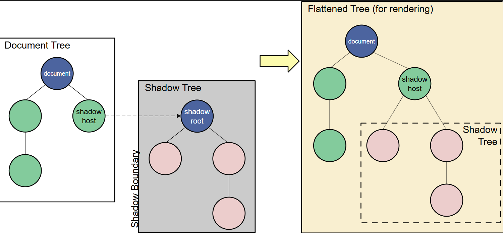

### **1️⃣ Why does the browser ignore extra spaces and line breaks inside HTML tags?**
✔ **Reason:** The browser collapses **whitespace (spaces, tabs, and newlines)** into a **single space** when rendering HTML.  
✔ **Why?**  
- HTML follows a **whitespace collapsing model** to maintain consistent formatting across different browsers.
- HTML is **not strict like Markdown or YAML**, so extra spaces are considered insignificant.
- This makes HTML **more readable and forgiving** for developers.

🔹 **Example:**
```html
<p>This     is
    a      test.</p>
```
✔ **Rendered as:**  
```html
This is a test.
```

---

### **2️⃣ Why does `innerHTML` completely replace the existing content instead of merging with it?**
✔ **Reason:** When you use `innerHTML`, the browser **parses and reconstructs the entire inner DOM** from scratch.  
✔ **Why?**  
- **Efficiency:** It's faster to replace an entire node than to track and merge individual differences.
- **Security:** Prevents partial injection of malicious scripts (although `innerHTML` is still risky).
- **Implementation:** The browser **destroys** the old DOM tree inside the element and **rebuilds it**.

🔹 **Example:**
```html
<div id="content">Hello</div>
<script>
  document.getElementById("content").innerHTML = "World";
</script>
```
✔ **Result:** The original `"Hello"` is **completely removed** and replaced by `"World"`.

---

### **3️⃣ Why do inline scripts (without `defer` or `async`) block rendering?**
✔ **Reason:** The browser **parses HTML sequentially** and **stops rendering when it encounters a `<script>` tag** without `defer` or `async`.  
✔ **Why?**  
- The browser **pauses parsing** to **fetch and execute** the script **before continuing**.
- This prevents **DOM modifications by scripts that depend on earlier content.**
- Without this blocking behavior, scripts might execute **before dependent elements exist**.

🔹 **Example of a blocking script:**
```html
<p>This will not be displayed until the script runs.</p>
<script>
  for (let i = 0; i < 1e9; i++) {} // Simulating delay
</script>
<p>This will also be delayed.</p>
```
✔ **Fix:** Use `defer` or place scripts at the **end of `<body>`**.

---

### **4️⃣ Why does `defer` work only on external scripts and not inline scripts?**
✔ **Reason:** The browser downloads **external scripts in parallel** but executes them **after the full HTML is parsed**.  
✔ **Why does it fail for inline scripts?**
- Inline scripts **don’t require downloading**, so there’s no need to defer execution.
- Browsers **ignore `defer`** in inline scripts because **there’s nothing to “fetch” asynchronously**.

🔹 **Example (works with external, ignored for inline):**
```html
<script defer>console.log("This runs immediately")</script>  <!-- IGNORED -->
<script defer src="script.js"></script>  <!-- EXECUTES AFTER PARSING -->
```
✔ **Fix:** Use `DOMContentLoaded` for inline scripts instead.

---

### **5️⃣ Why does the browser automatically close unclosed tags like `<p>` and `<li>`, but not `<div>`?**
✔ **Reason:** The browser follows **SGML-based parsing rules**, where **some elements are implicitly closed**, while others require explicit closing.  
✔ **Why?**
- `<p>`, `<li>`, `<td>` are **auto-closing** because they cannot contain other block-level elements.
- `<div>`, `<span>` **must be closed manually** because they are generic containers that may hold complex content.

🔹 **Example:**
```html
<p>First paragraph
<p>Second paragraph
```
✔ **Browser interprets it as:**
```html
<p>First paragraph</p>
<p>Second paragraph</p>
```
But **this won’t work for `<div>`:**
```html
<div>First</div>
<div>Second
```
❌ The second `<div>` will break layout since it's not auto-closed.

---

## **✅ Section 2: Browser Behavior & DOM Manipulation**
### **6️⃣ Why does modifying `innerHTML` remove event listeners on child elements?**
✔ **Reason:** `innerHTML` **destroys the existing DOM structure and replaces it**, removing all event listeners.  
✔ **Why?**
- JavaScript event listeners **are bound to elements, not the new HTML being inserted**.
- The browser **treats the new HTML as fresh content**, losing references to old event bindings.

🔹 **Example:**
```html
<div id="container">
  <button id="myButton">Click Me</button>
</div>
<script>
  document.getElementById("myButton").addEventListener("click", () => alert("Clicked!"));
  document.getElementById("container").innerHTML = "<button id='myButton'>New Button</button>";
</script>
```
❌ Clicking **will NOT trigger an alert**, because `innerHTML` **replaced the old button** with a new one.

✔ **Fix:** Use `addEventListener` **after modifying `innerHTML`**, or use **event delegation**.

---

### **7️⃣ Why does `getElementById` return `null` if the element is inside a `<template>`?**
✔ **Reason:** The browser **does not render `<template>` content until it is explicitly added to the DOM.**  
✔ **Why?**
- `<template>` stores HTML **in a document fragment** which is **not part of the active DOM**.
- `getElementById` **only works on elements that exist in the live DOM**.

🔹 **Example:**
```html
<template>
  <button id="btn">Click</button>
</template>
<script>
  console.log(document.getElementById("btn")); // ❌ Returns null
</script>
```
✔ **Fix:** You need to **clone and insert the template** into the DOM first.

---

### **8️⃣ Why does `document.write()` overwrite the whole page if used after the page has loaded?**
✔ **Reason:** If `document.write()` runs **after the page has finished loading**, it **replaces the entire document** because the parser treats it as a new document.  
✔ **Why?**
- During **HTML parsing**, `document.write()` **injects content inline**.
- After parsing is **complete**, calling `document.write()` **triggers a new document load**.

🔹 **Example:**
```html
<script>
  setTimeout(() => {
    document.write("<h1>Replaced the whole page!</h1>");
  }, 2000);
</script>
```
❌ The entire page **disappears** and only **"Replaced the whole page!"** remains.

✔ **Fix:** Never use `document.write()` after the page has loaded.

---

### **🔥 Recap: Key Takeaways**
| **Question** | **Key Reason** |
|-------------|---------------|
| Why does HTML ignore extra spaces? | **Whitespace collapsing model** |
| Why does `innerHTML` remove previous content? | **DOM is rebuilt from scratch** |
| Why do inline scripts block rendering? | **Parser stops execution until script runs** |
| Why does `defer` fail in inline scripts? | **No file to download → Browser ignores `defer`** |
| Why do `<p>` tags auto-close but `<div>` doesn’t? | **SGML parsing rules** |
| Why does modifying `innerHTML` remove event listeners? | **DOM elements are recreated** |
| Why does `getElementById` return `null` in `<template>`? | **`<template>` is not in the live DOM** |
| Why does `document.write()` overwrite the whole page? | **Triggers new document parsing** |


---

### **9️⃣ Why does a `<form>` inside another `<form>` cause issues, but `<fieldset>` does not?**  
✔ **Reason:** **HTML does not support nested `<form>` elements** because forms are designed to be **independent** submission containers.  
✔ **Why?**  
- The **outer form** tries to capture and submit all inputs, including the **inner form**, which leads to **unexpected behavior**.
- `<fieldset>` is different—it **groups form elements logically without breaking submission behavior**.

🔹 **Example (Incorrect):**
```html
<form>
  <input type="text" placeholder="Outer Form">
  <form>
    <input type="text" placeholder="Inner Form">
  </form>
</form>
```
❌ **This will NOT work properly.** The **inner form will not function correctly.**  

✅ **Correct Alternative:** Use `<fieldset>` instead:
```html
<form>
  <fieldset>
    <input type="text" placeholder="Grouped Fieldset">
  </fieldset>
</form>
```
✔ **Fix:** Always **use only one `<form>` per submission**.

---

### **🔟 Why does `visibility: hidden;` still occupy space, but `display: none;` removes it?**  
✔ **Reason:** `visibility: hidden;` only **hides the element visually**, while `display: none;` **removes it from the document flow.**  
✔ **Why?**  
- `visibility: hidden;` keeps the element **present in the layout** but makes it **invisible**.  
- `display: none;` **completely removes it** from rendering, causing the layout to **shift as if the element never existed**.

🔹 **Example:**  
```html
<p style="visibility: hidden;">Hidden but occupies space.</p>
<p style="display: none;">Removed from layout.</p>
```
✅ **Result:** The first `<p>` will still take up space, but the second one will **disappear completely**.

---

### **1️⃣1️⃣ Why do `<input type="number">` fields allow letters in some browsers but not others?**  
✔ **Reason:** **Browsers handle number inputs differently based on localization and keyboard behavior.**  
✔ **Why?**  
- Some browsers **prevent non-numeric input at the UI level** but still allow manual text pasting.  
- Some browsers **only validate on form submission** rather than preventing input altogether.

🔹 **Example:**
```html
<input type="number">
```
✔ **Fix:** Use `pattern="[0-9]*"` if you want **stronger control** over input behavior.

---

### **1️⃣2️⃣ Why does setting `required` on an input field not prevent form submission in some cases?**  
✔ **Reason:** Some browsers **only enforce `required` if the form is submitted via a button** (not via JavaScript).  
✔ **Why?**  
- If you submit a form using JavaScript (`form.submit()`), the `required` validation is **ignored**.  
- Some browsers may not validate `required` fields inside dynamically loaded content.

🔹 **Example:**
```html
<form>
  <input type="text" required>
  <button type="button" onclick="document.forms[0].submit()">Submit</button>
</form>
```
❌ **This will submit the form even if the input is empty.**  
✔ **Fix:** Use `reportValidity()` before submitting:
```js
document.forms[0].reportValidity();
```

---

### **1️⃣3️⃣ Why does an `<a>` tag’s `href="#"` jump to the top of the page?**  
✔ **Reason:** The `#` fragment in a URL is treated as a **reference to an anchor** within the page.  
✔ **Why?**  
- `href="#"` **does not point to any specific anchor**, so the browser **scrolls to the top**.
- This is **default browser behavior** to handle undefined fragment navigation.

🔹 **Example:**
```html
<a href="#">Click me</a>
```
✅ **Fix:** Use `event.preventDefault();` in JavaScript to disable this behavior:
```js
document.querySelector("a").addEventListener("click", function(event) {
  event.preventDefault();
});
```

---

### **1️⃣4️⃣ Why does `autocomplete="off"` not always work in browsers?**  
✔ **Reason:** Some browsers **ignore `autocomplete="off"` for security and user convenience**.  
✔ **Why?**  
- Browsers may **force autocomplete for login fields** to improve UX.
- Some browsers use **autofill settings** that override `autocomplete="off"`.

🔹 **Example:**
```html
<input type="text" autocomplete="off">
```
✅ **Fix:** Use **hidden fields** or unique `autocomplete` values (`new-password`) instead.

---


### **1️⃣5️⃣ Why do screen readers ignore `<b>` but recognize `<strong>`?**  
✔ **Reason:** `<b>` is purely **visual**, whereas `<strong>` **conveys emphasis** for screen readers.  
✔ **Why?**  
- `<strong>` tells assistive technologies that the text **is important**.
- `<b>` just makes text **bold** without semantic meaning.

🔹 **Example:**
```html
<p><strong>Important:</strong> Read this carefully.</p>
```
✅ **Fix:** Use `<strong>` for emphasis instead of `<b>`.

---

### **1️⃣6️⃣ Why does `<iframe sandbox>` restrict JavaScript execution inside the frame?**  
✔ **Reason:** The `sandbox` attribute **isolates iframe content** for security reasons.  
✔ **Why?**  
- Prevents **JavaScript execution** inside the iframe.
- Blocks **cookies and session storage**.
- Disables **form submissions** by default.

🔹 **Example:**
```html
<iframe src="https://example.com" sandbox></iframe>
```
✅ **Fix:** Use `sandbox="allow-scripts"` if you need JavaScript:
```html
<iframe src="https://example.com" sandbox="allow-scripts"></iframe>
```

---

### **1️⃣7️⃣ Why is `noopener noreferrer` recommended for links with `target="_blank"`?**  
✔ **Reason:** It **prevents the new tab from accessing the parent page’s `window.opener` property**, blocking phishing attacks.  
✔ **Why?**  
- Prevents **malicious pages from manipulating the parent window**.
- Improves **security and performance**.

🔹 **Example:**
```html
<a href="https://example.com" target="_blank" rel="noopener noreferrer">Safe Link</a>
```

---

### **1️⃣8️⃣ Why does `<meta viewport>` improve mobile responsiveness without CSS?**  
✔ **Reason:** It **scales the webpage correctly** based on the device width.  
✔ **Why?**  
- Without it, the page assumes **a default width of 980px**, making mobile pages appear zoomed out.
- The viewport meta tag **instructs the browser to scale the content correctly**.

🔹 **Example:**
```html
<meta name="viewport" content="width=device-width, initial-scale=1">
```

---

### **1️⃣9️⃣ Why does setting a `<textarea>` to `readonly` still allow text selection?**  
✔ **Reason:** `readonly` prevents **editing**, but not **copying**.  
✔ **Why?**  
- `readonly` means **users can interact but not modify** the field.
- `disabled` completely **prevents interaction**.

🔹 **Example:**
```html
<textarea readonly>This is readonly</textarea>
```
✅ **Fix:** Use `disabled` if selection should be blocked:
```html
<textarea disabled>This is disabled</textarea>
```

---

### **2️⃣0️⃣ Why do cookies set with `HttpOnly` prevent JavaScript from accessing them?**  
✔ **Reason:** `HttpOnly` **tells the browser not to expose the cookie to JavaScript** to prevent XSS attacks.  
✔ **Why?**  
- **Prevents JavaScript from stealing session cookies.**
- **Only accessible via HTTP headers**.

🔹 **Example:**  
```http
Set-Cookie: session=xyz; HttpOnly;
```

---


### **9️⃣ Why does a `<form>` inside another `<form>` cause issues, but `<fieldset>` does not?**  
✔ **Reason:** **HTML does not support nested `<form>` elements** because forms are designed to be **independent** submission containers.  
✔ **Why?**  
- The **outer form** tries to capture and submit all inputs, including the **inner form**, which leads to **unexpected behavior**.
- `<fieldset>` is different—it **groups form elements logically without breaking submission behavior**.

🔹 **Example (Incorrect):**
```html
<form>
  <input type="text" placeholder="Outer Form">
  <form>
    <input type="text" placeholder="Inner Form">
  </form>
</form>
```
❌ **This will NOT work properly.** The **inner form will not function correctly.**  

✅ **Correct Alternative:** Use `<fieldset>` instead:
```html
<form>
  <fieldset>
    <input type="text" placeholder="Grouped Fieldset">
  </fieldset>
</form>
```
✔ **Fix:** Always **use only one `<form>` per submission**.

---

### **🔟 Why does `visibility: hidden;` still occupy space, but `display: none;` removes it?**  
✔ **Reason:** `visibility: hidden;` only **hides the element visually**, while `display: none;` **removes it from the document flow.**  
✔ **Why?**  
- `visibility: hidden;` keeps the element **present in the layout** but makes it **invisible**.  
- `display: none;` **completely removes it** from rendering, causing the layout to **shift as if the element never existed**.

🔹 **Example:**  
```html
<p style="visibility: hidden;">Hidden but occupies space.</p>
<p style="display: none;">Removed from layout.</p>
```
✅ **Result:** The first `<p>` will still take up space, but the second one will **disappear completely**.

---

### **1️⃣1️⃣ Why do `<input type="number">` fields allow letters in some browsers but not others?**  
✔ **Reason:** **Browsers handle number inputs differently based on localization and keyboard behavior.**  
✔ **Why?**  
- Some browsers **prevent non-numeric input at the UI level** but still allow manual text pasting.  
- Some browsers **only validate on form submission** rather than preventing input altogether.

🔹 **Example:**
```html
<input type="number">
```
✔ **Fix:** Use `pattern="[0-9]*"` if you want **stronger control** over input behavior.

---

### **1️⃣2️⃣ Why does setting `required` on an input field not prevent form submission in some cases?**  
✔ **Reason:** Some browsers **only enforce `required` if the form is submitted via a button** (not via JavaScript).  
✔ **Why?**  
- If you submit a form using JavaScript (`form.submit()`), the `required` validation is **ignored**.  
- Some browsers may not validate `required` fields inside dynamically loaded content.

🔹 **Example:**
```html
<form>
  <input type="text" required>
  <button type="button" onclick="document.forms[0].submit()">Submit</button>
</form>
```
❌ **This will submit the form even if the input is empty.**  
✔ **Fix:** Use `reportValidity()` before submitting:
```js
document.forms[0].reportValidity();
```

---

### **1️⃣3️⃣ Why does an `<a>` tag’s `href="#"` jump to the top of the page?**  
✔ **Reason:** The `#` fragment in a URL is treated as a **reference to an anchor** within the page.  
✔ **Why?**  
- `href="#"` **does not point to any specific anchor**, so the browser **scrolls to the top**.
- This is **default browser behavior** to handle undefined fragment navigation.

🔹 **Example:**
```html
<a href="#">Click me</a>
```
✅ **Fix:** Use `event.preventDefault();` in JavaScript to disable this behavior:
```js
document.querySelector("a").addEventListener("click", function(event) {
  event.preventDefault();
});
```

---

### **1️⃣4️⃣ Why does `autocomplete="off"` not always work in browsers?**  
✔ **Reason:** Some browsers **ignore `autocomplete="off"` for security and user convenience**.  
✔ **Why?**  
- Browsers may **force autocomplete for login fields** to improve UX.
- Some browsers use **autofill settings** that override `autocomplete="off"`.

🔹 **Example:**
```html
<input type="text" autocomplete="off">
```
✅ **Fix:** Use **hidden fields** or unique `autocomplete` values (`new-password`) instead.

---

## **✅ Section 3: Accessibility, Performance & Security**  

### **1️⃣5️⃣ Why do screen readers ignore `<b>` but recognize `<strong>`?**  
✔ **Reason:** `<b>` is purely **visual**, whereas `<strong>` **conveys emphasis** for screen readers.  
✔ **Why?**  
- `<strong>` tells assistive technologies that the text **is important**.
- `<b>` just makes text **bold** without semantic meaning.

🔹 **Example:**
```html
<p><strong>Important:</strong> Read this carefully.</p>
```
✅ **Fix:** Use `<strong>` for emphasis instead of `<b>`.

---

### **1️⃣6️⃣ Why does `<iframe sandbox>` restrict JavaScript execution inside the frame?**  
✔ **Reason:** The `sandbox` attribute **isolates iframe content** for security reasons.  
✔ **Why?**  
- Prevents **JavaScript execution** inside the iframe.
- Blocks **cookies and session storage**.
- Disables **form submissions** by default.

🔹 **Example:**
```html
<iframe src="https://example.com" sandbox></iframe>
```
✅ **Fix:** Use `sandbox="allow-scripts"` if you need JavaScript:
```html
<iframe src="https://example.com" sandbox="allow-scripts"></iframe>
```

---

### **1️⃣7️⃣ Why is `noopener noreferrer` recommended for links with `target="_blank"`?**  
✔ **Reason:** It **prevents the new tab from accessing the parent page’s `window.opener` property**, blocking phishing attacks.  
✔ **Why?**  
- Prevents **malicious pages from manipulating the parent window**.
- Improves **security and performance**.

🔹 **Example:**
```html
<a href="https://example.com" target="_blank" rel="noopener noreferrer">Safe Link</a>
```

---

### **1️⃣8️⃣ Why does `<meta viewport>` improve mobile responsiveness without CSS?**  
✔ **Reason:** It **scales the webpage correctly** based on the device width.  
✔ **Why?**  
- Without it, the page assumes **a default width of 980px**, making mobile pages appear zoomed out.
- The viewport meta tag **instructs the browser to scale the content correctly**.

🔹 **Example:**
```html
<meta name="viewport" content="width=device-width, initial-scale=1">
```

---

### **1️⃣9️⃣ Why does setting a `<textarea>` to `readonly` still allow text selection?**  
✔ **Reason:** `readonly` prevents **editing**, but not **copying**.  
✔ **Why?**  
- `readonly` means **users can interact but not modify** the field.
- `disabled` completely **prevents interaction**.

🔹 **Example:**
```html
<textarea readonly>This is readonly</textarea>
```
✅ **Fix:** Use `disabled` if selection should be blocked:
```html
<textarea disabled>This is disabled</textarea>
```

---

### **2️⃣0️⃣ Why do cookies set with `HttpOnly` prevent JavaScript from accessing them?**  
✔ **Reason:** `HttpOnly` **tells the browser not to expose the cookie to JavaScript** to prevent XSS attacks.  
✔ **Why?**  
- **Prevents JavaScript from stealing session cookies.**
- **Only accessible via HTTP headers**.

🔹 **Example:**  
```http
Set-Cookie: session=xyz; HttpOnly;
```

---


### **2️⃣1️⃣ Why do browsers prefetch DNS queries when they see `rel="dns-prefetch"`?**  
✔ **Reason:** DNS prefetching **resolves domain names early** to speed up future resource loading.  
✔ **Why?**  
- Normally, when the browser needs an external resource (image, script, etc.), it first performs a **DNS lookup** to resolve the domain name.  
- **DNS-prefetch** allows the browser to **resolve domain names earlier**, reducing latency when the actual request is made.

🔹 **Example:**  
```html
<link rel="dns-prefetch" href="https://cdn.example.com">
```
✅ **Effect:** The browser **pre-resolves `cdn.example.com`**, so when an actual resource from it is requested, it loads faster.  

---

### **2️⃣2️⃣ Why do cookies set with `HttpOnly` prevent JavaScript from accessing them?**  
✔ **Reason:** The `HttpOnly` flag prevents **client-side JavaScript from accessing cookies**, which helps mitigate **Cross-Site Scripting (XSS) attacks**.  
✔ **Why?**  
- Normally, JavaScript can **access cookies using `document.cookie`**, which poses a **security risk** if an attacker injects malicious scripts.
- With `HttpOnly`, the cookie **can only be read by the server**, preventing client-side theft.

🔹 **Example:**  
```http
Set-Cookie: session=abc123; HttpOnly;
```
❌ **JavaScript cannot access this cookie:**
```js
console.log(document.cookie); // ❌ "session" cookie is NOT visible
```

✅ **Fix:** Use `HttpOnly` for sensitive authentication cookies.

---

### **2️⃣3️⃣ Why does `Content-Security-Policy` help prevent XSS (Cross-Site Scripting) attacks?**  
✔ **Reason:** CSP **restricts where scripts can load from**, reducing the risk of attackers injecting malicious JavaScript.  
✔ **Why?**  
- XSS occurs when **untrusted input** (e.g., from a URL or form) is executed as JavaScript.
- **CSP blocks inline scripts** unless explicitly allowed and restricts script sources.

🔹 **Example:**  
```http
Content-Security-Policy: default-src 'self'; script-src 'self' https://apis.example.com;
```
✅ **Effect:**  
- **Allows scripts only from the current site (`self`) and `apis.example.com`.**  
- **Blocks inline scripts (`<script>alert(1)</script>` won’t execute).**

✔ **Best Practice:** Always define a **strict CSP policy** to prevent script injection attacks.

---

### **2️⃣4️⃣ Why does `preload` improve performance compared to `prefetch`?**  
✔ **Reason:** `preload` is used for **high-priority resources** that are **needed immediately**, whereas `prefetch` is for **future requests**.  
✔ **Why?**  
- `preload` **loads a resource ASAP**, before the browser even sees that it’s needed.
- `prefetch` **loads a resource in the background for later use**.

🔹 **Example of `preload`:**
```html
<link rel="preload" href="styles.css" as="style">
```
✅ **Effect:** The browser loads `styles.css` **immediately**, even before it encounters a `<link>` in the `<head>`.

🔹 **Example of `prefetch`:**
```html
<link rel="prefetch" href="next-page.html">
```
✅ **Effect:** The browser **downloads `next-page.html` in advance**, so if the user clicks a link to it, it loads faster.

✔ **Best Practice:** Use `preload` for **critical assets** (fonts, above-the-fold images) and `prefetch` for **next-page navigation**.

---

### **2️⃣5️⃣ Why does `<picture>` offer more flexibility than `srcset` in ``?**  
✔ **Reason:** `<picture>` allows **full control over different image formats**, while `srcset` only chooses different resolutions.  
✔ **Why?**  
- `<picture>` can **switch file formats** (`.jpg`, `.webp`, `.avif`), not just resolutions.
- `srcset` **only picks the best resolution** based on screen size.

🔹 **Example of `<picture>` (format-based switching):**
```html
<picture>
  <source srcset="image.avif" type="image/avif">
  <source srcset="image.webp" type="image/webp">
  
</picture>
```
✅ **Effect:**  
- The browser loads **AVIF if supported**, then **WebP**, and finally **JPEG** as fallback.

🔹 **Example of `srcset` (resolution-based switching):**
```html

```
✅ **Effect:**  
- The browser picks **the most appropriate resolution** but **cannot switch formats**.

✔ **Best Practice:**  
- Use `<picture>` **when format flexibility is needed**.  
- Use `srcset` **when only resolution switching is required**.

---

### **🚀 Summary: Key Takeaways**
| **Question** | **Key Reason** |
|-------------|---------------|
| Why does `dns-prefetch` help performance? | **Pre-resolves domain names early** |
| Why does `HttpOnly` protect cookies? | **Prevents JavaScript from reading session cookies** |
| Why does `Content-Security-Policy` prevent XSS? | **Blocks inline scripts & restricts script sources** |
| Why does `preload` improve loading speed? | **Forces critical resources to load immediately** |
| Why does `<picture>` offer more control than `srcset`? | **Supports format switching, not just resolution** |

---

## **✅ 2️⃣6️⃣ Why does `<meta viewport>` improve mobile responsiveness without CSS?**  
✔ **Reason:**  
The `<meta viewport>` tag **controls how a webpage is scaled** on mobile devices **before** any CSS is applied.  

✔ **Why?**  
- By default, **browsers assume a webpage is 980px wide**, even if it’s on a smaller screen.  
- `<meta name="viewport" content="width=device-width, initial-scale=1.0">` tells the browser to:  
  - Use the **actual screen width** instead of assuming 980px.  
  - Scale the content correctly for **different devices**.  
  - Prevent **automatic zoom-out** that happens when no viewport is set.

🔹 **Example:**  
```html
<meta name="viewport" content="width=device-width, initial-scale=1.0">
```
✅ **Without this tag**, mobile pages may appear **zoomed out and unreadable**.

---

## **✅ 2️⃣7️⃣ Why does setting a `<textarea>` to `readonly` still allow text selection?**  
✔ **Reason:**  
`readonly` means the **text cannot be edited**, but it **does not prevent selection or copying**.  

✔ **Why?**  
- The `readonly` attribute **only blocks typing and modification**.  
- Unlike `disabled`, **the user can still interact with the content** (e.g., selecting, copying).  
- This is useful when you want **to show text but prevent accidental edits**.

🔹 **Example:**  
```html
<textarea readonly>This is readonly</textarea>
```
✅ **Users can still select & copy this text**.

✔ **Fix:** If you want to **disable selection too**, use **CSS**:  
```css
textarea {
  user-select: none;
}
```
🔹 **Alternative (using `disabled`):**  
```html
<textarea disabled>This is fully disabled</textarea>
```
✅ **Users cannot interact with this field at all.**

---

## **✅ 2️⃣8️⃣ Why do browsers prefetch DNS queries when they see `rel="dns-prefetch"`?**  
✔ **Reason:**  
`dns-prefetch` tells the browser to **resolve a domain name early**, reducing latency when the actual request is made.  

✔ **Why?**  
- Normally, when a browser **loads external content**, it must **first perform a DNS lookup** to resolve the domain name.  
- This lookup **introduces delay**.  
- `dns-prefetch` **pre-resolves domain names** so that when an actual request is made, **it loads faster**.

🔹 **Example:**  
```html
<link rel="dns-prefetch" href="https://cdn.example.com">
```
✅ **The browser pre-resolves `cdn.example.com`**, reducing the delay **when an image or script from this domain is requested**.

✔ **When to use?**  
- On **CDN-hosted assets** (fonts, images, scripts).  
- For **third-party APIs** that your page will call.

---

## **✅ 2️⃣9️⃣ Why do cookies set with `HttpOnly` prevent JavaScript from accessing them?**  
✔ **Reason:**  
The `HttpOnly` flag **prevents JavaScript from reading cookies**, which **reduces the risk of XSS attacks**.

✔ **Why?**  
- Normally, JavaScript can read cookies using:  
  ```js
  console.log(document.cookie); // ❌ Can expose sensitive info!
  ```
- If an attacker **injects malicious JavaScript** (XSS attack), they can **steal session cookies**.
- **`HttpOnly` prevents this**, making the cookie **only accessible by the server**.

🔹 **Example (Server-Side Cookie Header):**  
```http
Set-Cookie: session=abc123; HttpOnly;
```
✅ Now, **JavaScript cannot access this cookie**, but it still works for **authentication requests**.

✔ **When to use?**  
- **Always for session cookies & authentication tokens**.

---

## **✅ 3️⃣0️⃣ Why does `Content-Security-Policy` help prevent XSS (Cross-Site Scripting) attacks?**  
✔ **Reason:**  
`Content-Security-Policy` (CSP) **restricts where scripts can load from**, preventing malicious injections.  

✔ **Why?**  
- XSS occurs when **attackers inject untrusted scripts** (e.g., `<script>alert('Hacked!')</script>`).  
- CSP **blocks inline scripts** unless explicitly allowed.
- CSP **limits script sources**, preventing malicious code execution.

🔹 **Example (Strict CSP Header):**  
```http
Content-Security-Policy: default-src 'self'; script-src 'self' https://apis.example.com;
```
✅ **Effect:**  
- **Allows scripts only from the same site (`self`) and `apis.example.com`**.  
- **Blocks inline scripts (`<script>alert(1)</script>` won’t execute).**  

✔ **Best Practice:**  
- **Use a strict CSP policy** for **secure web apps**.  

---

### **🔥 Final Recap: Key Takeaways**
| **Question** | **Key Reason** |
|-------------|---------------|
| Why does `<meta viewport>` improve responsiveness? | **Prevents zoom-out, scales content properly** |
| Why does `readonly` still allow selection? | **Blocks editing but allows copying** |
| Why does `dns-prefetch` improve performance? | **Pre-resolves domain names early** |
| Why does `HttpOnly` protect cookies? | **Prevents JavaScript from reading session cookies** |
| Why does `Content-Security-Policy` prevent XSS? | **Blocks inline scripts & restricts script sources** |

---

Note : Shadow DOM (In progress) ; example - video tag



